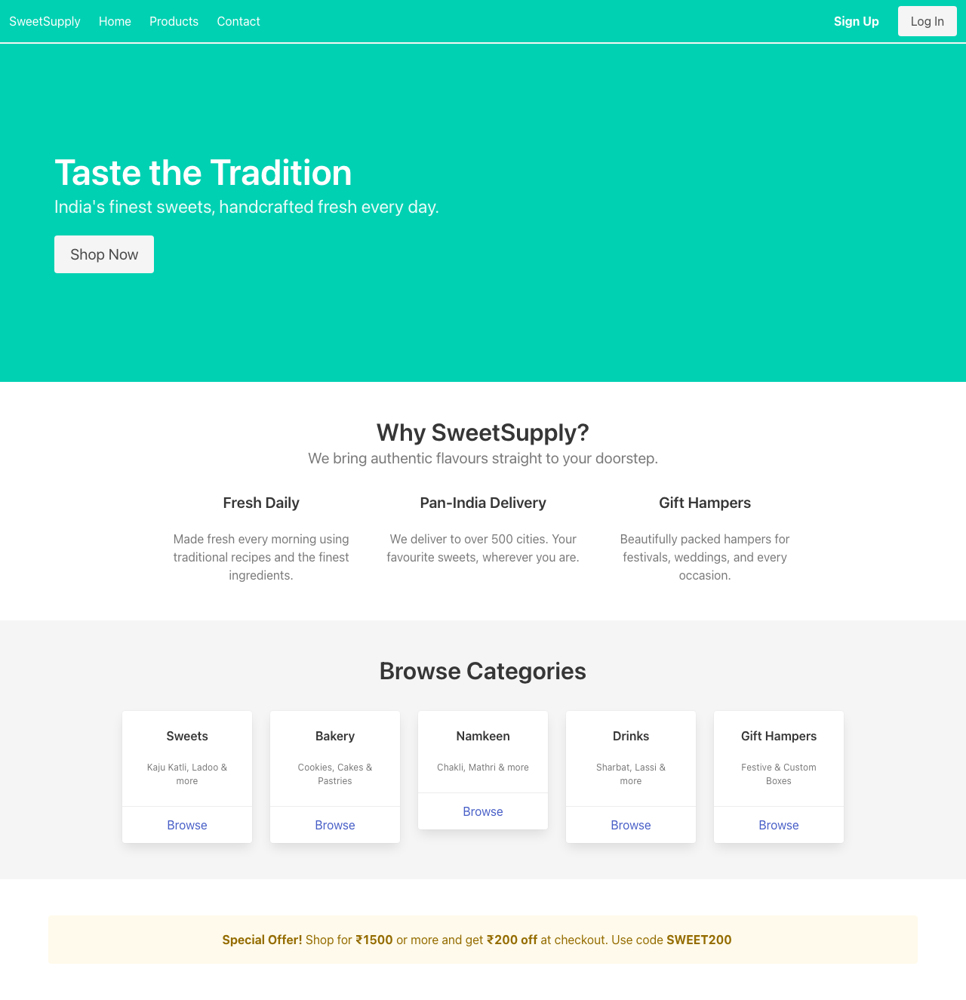
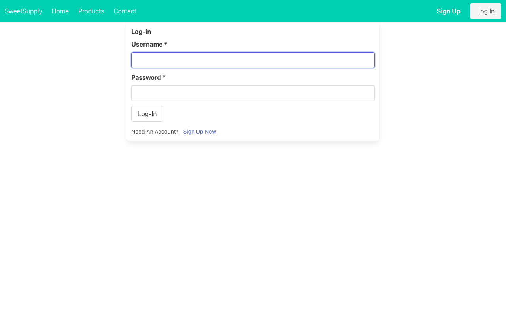
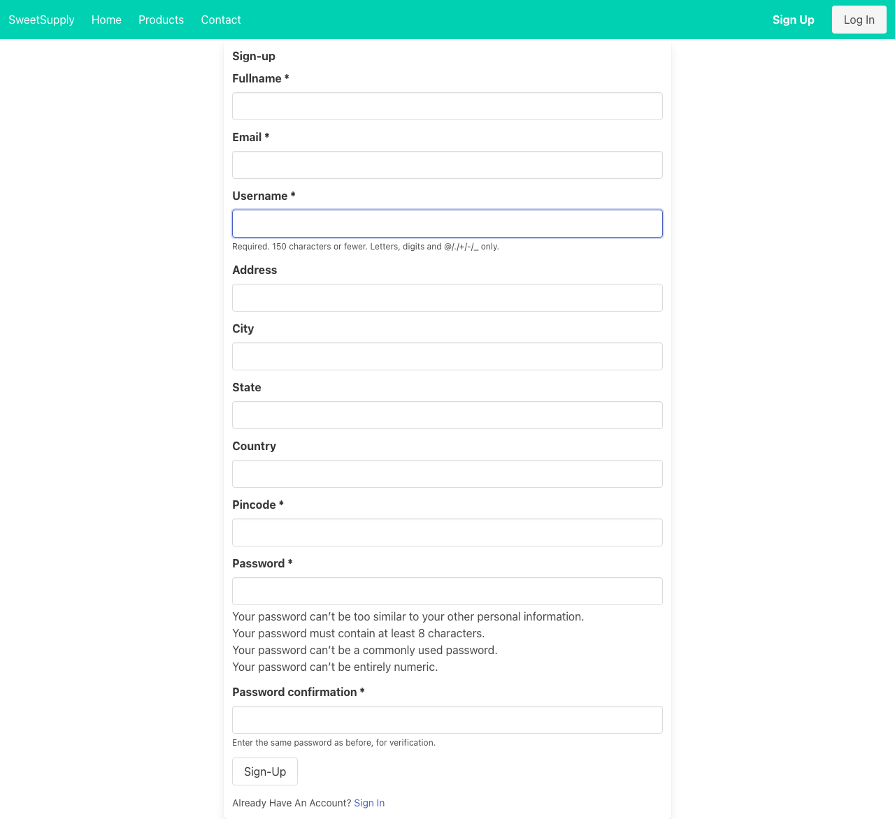

# UrbanCloth

A clothing e-commerce web application built with Flask and Python.

## Features

- Browse Men's and Women's clothing collections
- Product listings with brand, name, and price
- User registration and login with secure password hashing (bcrypt)
- Wishlist and shopping bag (requires login)
- Responsive UI with Bootstrap 4
- Image carousel on the homepage

## Tech Stack

- **Backend:** Python, Flask, Flask-SQLAlchemy, Flask-Login, Flask-Bcrypt, Flask-WTF
- **Frontend:** HTML5, Bootstrap 4, CSS3
- **Database:** SQLite

## Screenshots

<!-- Add screenshots here -->
| Home Page | Men's Collection | Women's Collection |
|-----------|-----------------|-------------------|
|  |  |  |

| Login | Register |
|-------|----------|
|  |  |

## Setup & Run

```bash
# Clone the repository
git clone https://github.com/GagandeepSM/Urban-Cloth.git
cd Urban-Cloth

# Create a virtual environment and activate it
python -m venv venv
source venv/bin/activate       # On Windows: venv\Scripts\activate

# Install dependencies
pip install -r requirements.txt

# Run the app
cd "Clothing e-commerce"
python home.py
```

Open your browser at `http://127.0.0.1:5000`

## Project Structure

```
Urban-Cloth/
├── Clothing e-commerce/
│   ├── home.py                  # App entry point
│   └── urbancloth/
│       ├── __init__.py          # App factory & config
│       ├── routes.py            # URL routes & view functions
│       ├── models.py            # Database models (User, Post)
│       ├── forms.py             # WTForms (Login, Register, Bag)
│       ├── static/              # Images & CSS
│       └── templates/           # Jinja2 HTML templates
├── requirements.txt
└── README.md
```
